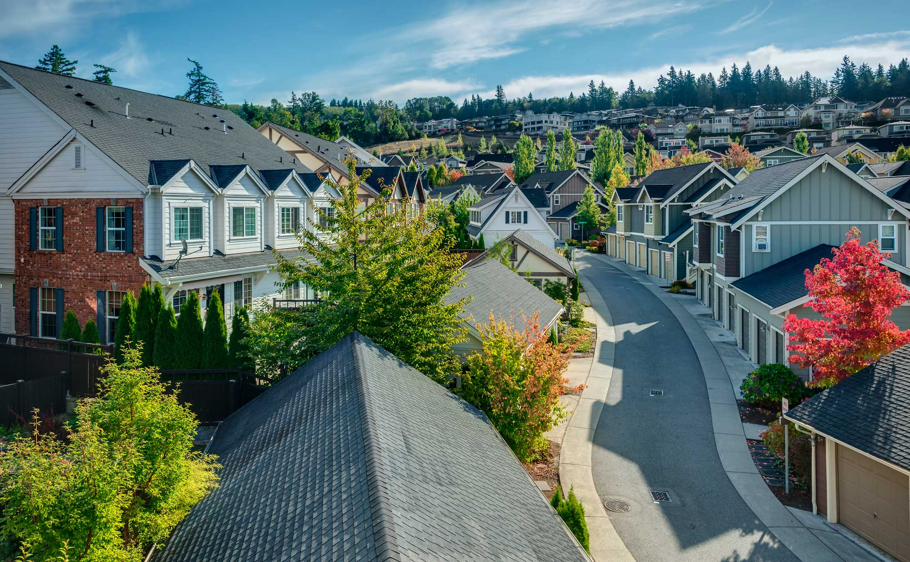

# Real Estate Development Recommendations for King County, Washington

Author: Rebecca Neel

## Overview

This project examines data collected for about 20,000 homes sold in King County, Washington in the years 2018 and 2019. The aim is to provide concrete recommendations to real estate developers in the King County area for maximizing revenue based on the coefficients of a multiple linear regression with home price as the target variable.

## Business Problem

The goal of using linear regression here is to isolate the effect of a single feature on the overall price of a house. For example, if two houses are identical EXCEPT for the fact that one is built on a waterfront and the other is not, how much more will the waterfront home sell for, approximately?

Linear regression answers this question, providing real estate developers with a way to gauge where to spend their money and effort during development to result in return on investment.

Essentially, the coefficients of our linear regression model provide a decision metric for real estate developers making decisions about how much to spend on the development of new properties.

## Data

We used data collected for about 20,000 homes sold in King County, Washington in the years 2018 and 2019.

Data on the homes included the most recent selling price, square footage (of the interior, the lot and the basement), whether or not the house has a view or is located on a waterfront, the date of sale, the zipcode, the construction quality denoted as a grade given by King County Assessors, condition of the home, number of bedrooms, bathrooms and floors and a few other features.

Zipcode was converted to school district for the purpose of analysis.

## Modeling

The baseline model uses grade as the solitary feature with which to predict home price. Grade was chosen as it is the most highly correlated feature with price. This model has an R^2 of 38.4%.

Adding the next three most highly correlated features with price improved the R^2 to 45.6%. One of these features was then removed due to suspected multicollinearity, decreasing R^2 to 44.8%.

Adding the features "view" and "waterfront" did little to improve the R^2, but the coefficients are interpretable and statistically significant.

Adding school district improved the model's R^2 to 73%. Most of the model coefficients for school districts (16 out of 18) were statistically significant and interpretable. Additionally, school district encodes the only "location-based" information about the homes which, intuitively, seems to be an important feature in home value, so it was an important feature to include.


## Regression Results

After dropping another feature due to suspected multicollinearity, the model's final R^2 is 72.3% on the training data and the test data.

- Our model explains 72.3% of the variance in home price.

- The model coefficients are statistically significant and fall within reasonably narrow confidence intervals.

- The location of a home in certain school districts can increase the value of a home by nearly $300,000. Developing land in the Mercer Island or Bellevue school districts is a profitable move. The Seattle, Lake Washington, Issaquah and Northshore school districts are also reasonable. Developing land in other school districts seems to be questionable, unless some other feature (like waterfront) makes up for the decrease in price due to school district.

- A home on a waterfront costs about $175,000 more than a similar home NOT on a waterfront. If you can purchase land on a waterfront for a reasonable price, this construction sells for a lot more.

- Construction quality (grade) increases the price of a home by roughly $50,000 for every one-level increase in grade. Assuming that you are working with a contractor to build multiple houses at once, if you can leverage economies of scale to increase the construction quality by one or several grades while keeping the cost per house significantly below $50,000 per grade increase, then you can earn more by building higher quality.

- Having a view can earn you $30,000 more than not having a view. This is probably too difficult to optimize for given the expected return, but it is a factor to consider when planning construction.

- Every increase in square footage by 1 square foot increases the home price by $100. (This doesn't necessarily sound like much, but a 2000 sqft home would sell for $100,000 more than an otherwise similar 1000 sqft home by this logic.) Large increases in square footage, if they don't create similarly large increases in the cost of construction, could increase returns.

- The condition number of my model is extremely large. This could be because the data is not scaled, so a small change in the model could drastically change the intercept of the regression. However, I am possibly still dealing with some multicollinearity as well, despite dropping several features that were highly correlated with one another.

## Conclusion

This analysis leads to three recommendations for maximizing revenue on real estate development projects in King County:

- Buy land in the Mercer Island or Bellevue school districts, if possible.
- Look for waterfront land which is less than $175,000 more than similar land not on a waterfront.
- Hire contractors who can increase the quality of construction by a grade or more for less than $50,000 per home per grade increase.

## Next Steps

Combining this data with information about construction and land costs in the King County area would allow a more thorough analysis of opportunities to consider.

Scaling the price, though it would change the interpretation of the model coefficients, could result in a lower condition number.

## For More Information

See the full analysis in this [Jupyter Notebook](./analysis.ipynb) or review the [PowerPoint presentation](./presentation.pdf).

For additional information, contact Rebecca Neel at rebecc.clark@gmail.com.

## Repository Structure

```
├── Data
├── analysis.ipynb
├── price_by_grade.png
├── README.md
└── requirements.txt *for sharing via Binder
```